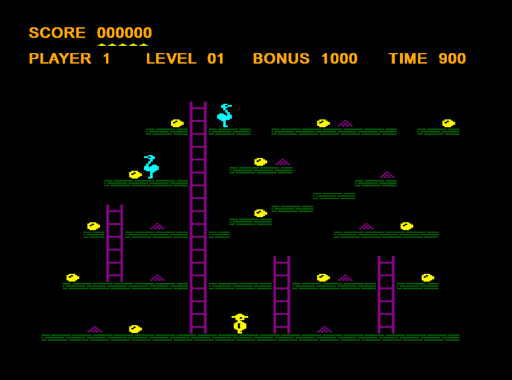
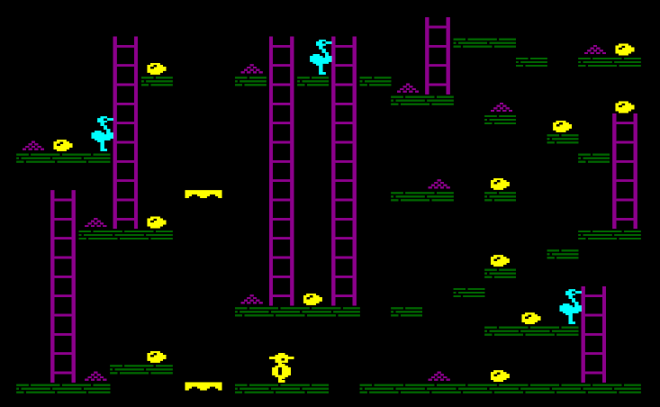

# PygameChuckie

A game written in python, inspired by Chuckie Egg (1983).
After many happy hours playing against my whole 
family, trying to avoid the flying duck and not 
fall off of the lifts.

ChuckieEgg was originally written by Nigel Alderton 
and released by A&F.

This version is a recreation, not a simulation or 
emulation, it attempts to mimic the game play in
the BBC/Acorn version.

Thanks to the following youtubers for sharing their 
play throughs:

* BBC edition: https://www.youtube.com/watch?v=D1TwmOeCvTw
* Https://www.youtube.com/watch?v=4RKwv-EJYtM

The game is written in python and using the pygame 
package.
I have employed an object-oriented approach to 
(stubbornly) demonstrate how good OO programming is 
still relevant in 2023.

 Action shot ^^

## Getting Started:

This version has been tested on Ubuntu 20.04 and 
Windows 10.

You will require a python3 installation, and the 
pygame package:

> pip3 install pygame

Clone the repo, or download the zip. From within the directory you just put the code into:

> python chuckie_egg.py

## Instructions:

Collect all the eggs, don't let the Hen's get you, 
and don't loiter on lifts. Direction keys: a, d, s, 
w and space to jump. 

Extra life given for 10,000 points.

This release contains only the first 5 levels, there 
are more to come in future releases.  This release is for 
testing the game play and responsiveness. 

There are bugs! and things to fix. Be warned.
Enjoy.

### Development information / Tweaking support:

For those wanting to tinker, check out source/level_data.py, you can easily create your own levels or edit existing ones. 
The 2d array contains the following characters to denote elements:

'f' - for floor
'l' - for ladder
'e' - for egg
'g' - for grain
'hr' - for the starting position of a right-facing hen.
'hl' - for the starting position of a left-facing hen.
'cr' - starting position of Harry(*), facing right
'cl' - starting position of Harry(*), facing left
'-l' - left hand tile of a lift.
'-r' - right hand tile of a lift.
(*) you must have one and only one Harry on the board for the level to load successfully.

See also/further reading:
* https://en.wikipedia.org/wiki/Chuckie_Egg

